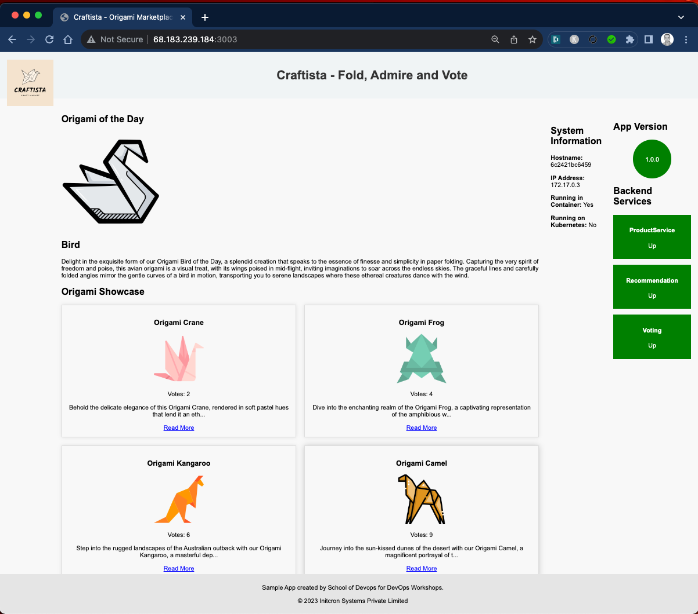
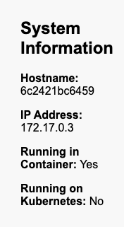
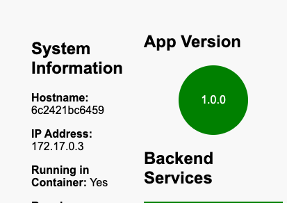
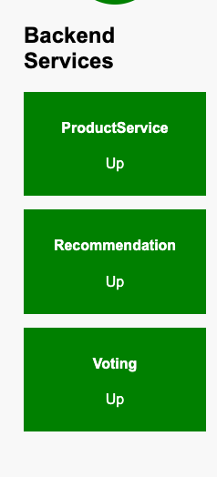
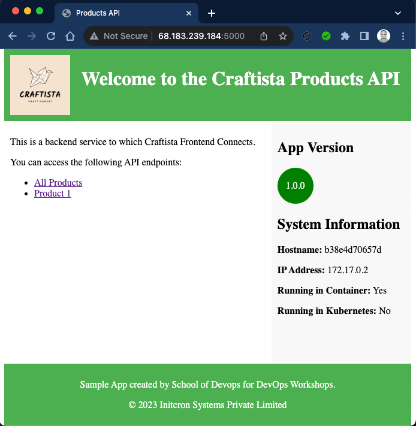
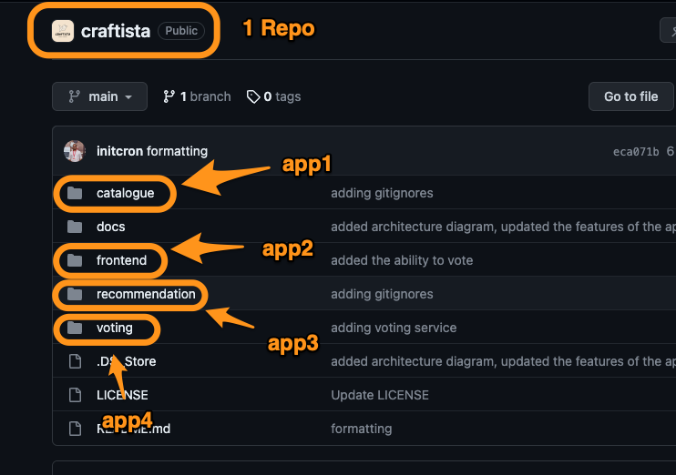

# Craftista - A Perfect App for Devops Projects

We, at [School of Devops](www.schoolofdevops.com) take pride to introduce you to Craftista, a Polyglot, Micro-Services based application, built with the Modern Tech stack, specially designed to be used as a learning app to buid Devops Projects with.  

## What is Craftista: Celebrating the Art of Origami 

Welcome to Craftista, a unique web platform dedicated to the beautiful and intricate world of origami. Craftista is a place where origami enthusiasts and artists come together to showcase their creations, share their passion, and engage with a like-minded community. Our platform allows users to explore a diverse range of origami art, vote for their favorites, and get inspired by the daily featured origami.

### Features

**Origami Showcase**: Discover a wide array of origami creations, ranging from traditional designs to contemporary art pieces. Each origami has its own story and charm, waiting to be unfolded.

**User Voting System**: Participate in the community by voting for your favorite origami pieces. See what creations are trending and show your support for the artists.
Daily Origami Recommendation: Be greeted daily with a new origami masterpiece, handpicked to inspire and ignite your passion for paper folding.

**Origami of the Day**: Learn more about origami artists, their work, and their journey into the world of paper art.

**Interactive Community**: Engage with other origami enthusiasts, share insights, and discuss techniques.

## The Architecture 

Craftista is not just an origami platform; it's a demonstration of modern web application development and microservices architecture. It leverages multiple backend services, including:

### Micro Service 1 - Frontend

**Purpose**: 
Serves as the frontend, acts as a router, integrates with all other services renders the  Graphical Interface.  

**Language**: Node.js  

**Framework**: Express.js  

**Why Express.js**: 
Express.js is a widely adopted and highly versatile web application framework for Node.js, offering several compelling reasons for its use. Its simplicity and minimalistic design make it an excellent choice for both beginners and experienced developers. Express.js provides a robust set of features and middleware, enabling rapid development of web applications and APIs. It excels at handling routes, HTTP requests, and various response types, allowing developers to build scalable and efficient server-side applications. Additionally, its active community and extensive ecosystem of plugins and modules make it easy to integrate with databases, authentication systems, and other technologies, streamlining the development process. Express.js's performance and flexibility, combined with its supportive community, make it a go-to choice for building web applications and APIs in Node.js.  

**Who uses Express.js:** 
Uber, Netflix, PayPal, LinkedIn, Groupon, Mozilla, Trello, Stack Overflow, GitHub, Myntra, Zomato,Trivago  

### Micro Service 2 - Catalogue

**Purpose:** 
Manages the origami showcase, including origami details and images.  

**Language:** Python  

**Framework:** Flask  

**Why Flask:** 
Flask is a lightweight and highly flexible Python web framework, making it an attractive choice for web developers. Its simplicity and minimalist design offer a low learning curve, making it ideal for small to medium-sized projects or when you need to quickly prototype an idea. Flask allows developers the freedom to choose components and libraries, giving them control over the tech stack and allowing for greater customization. It's well-suited for building RESTful APIs and web applications due to its clean and intuitive routing system. Flask also benefits from a supportive community and extensive documentation, ensuring developers have access to valuable resources when facing challenges. Overall, Flask's simplicity, flexibility, and ease of use make it a compelling choice for Python developers looking to build web applications and APIs efficiently and with a high degree of control.  

**Who uses Flask:** 
Netflix, Reddit, Lyft, Airbnb, Pinterest, Twilio, LinkedIn, MIT, Uber, Dropbox, Whitehouse.gov, Coursera  

#### Backing Service 1: catalogue-db  
Phase 1 : JSON File  
Phase 2 : MongoDB  

###  Micro Service 3 - Voting

**Purpose:** 
Handles the voting functionality, allowing users to vote for their favorite origami.  
**Framework:** Spring Boot   
**Why Spring Boot Framework:**
Spring Boot is a powerful and widely adopted Java-based framework that offers numerous advantages for developers. It excels in simplifying the development of production-ready, stand-alone, and enterprise-grade applications. One of its key strengths is convention over configuration, which significantly reduces boilerplate code and allows developers to focus on building features rather than dealing with infrastructure concerns. Spring Boot's comprehensive ecosystem provides support for various modules like data access, security, and messaging, simplifying integration with databases and third-party services. It also includes embedded servers, making it easy to deploy applications without the need for external web servers. Moreover, Spring Boot benefits from a vast and active community, ensuring access to extensive documentation and a wealth of resources. Overall, Spring Boot is a go-to choice for Java developers seeking rapid application development, maintainability, and scalability for a wide range of projects, from microservices to monolithic applications.  
**Who uses Spring Boot:**  
Adobe, Microsoft, Yelp, American Express, Intuit, Vimeo, SoundCloud  

#### Backing Service 2 : voting-db
Phase 1 : H2  
Phase 2 : PostgreSQL  

###  Micro Service 4 - Recommendation 

**Purpose:** 
Selects and presents the daily origami recommendation.    
**Language:** Golang  
**Why Golang:** 
Go, also known as Golang, is a programming language developed by Google. It has gained popularity for its simplicity, performance, and suitability for building scalable and concurrent applications. It's also a compiled language, which makes it more efficient than other languages.Many companies and projects around the world use Go in their tech stack. Golang's performance and flexibility make it a compelling choice for developers looking to build robust and reliable applications. Many DevOps tools are written in Go to take advantage of these benefits.  
**DevOps tools written in Go:**: 
Docker, Kubernetes, Prometheus, Terraform, Consul, Nomad, Packer, Vault, Grafana, etcd, Istio   
**Who uses Go Lang:** 
Google, Dropbox, Uber, Netflix, Twitch, Cloudflare, Heroku, X (Twitter), BBC  

Each service is built using a different technology stack, showcasing polyglot persistence and diverse backend technologies.

## Why Craftista is the Best Application for Devops Projects ?

### 01 - Real Life Like - Micro Services, Polyglot App: If you look at the architecture and the services of Craftista App, it resembles a real life use case. It's a polyglot microservices based application, with multiple backend services, each with its own technology stack. You can think of it as a simplified version of a E-Commerce platform as it has the essential services such as a Modern UI written in Node.Js, a Product Catalogue Service, a Recommendation Engine and even a User Review App (Voting Service). When you are working with Craftista, it is as good as building a Real Life Project. 

### 02 - Modern Tech Stack:
We have made deliberate efforts to choose the technologies commonly used by organisations across the globe to build modern applications which technology choice such as  Express.js Framework based off Node.js, Golang, Python Flask Framework and Java Based Spring Boot Framework. 

### 03 - Simplified Design:
We have deliberately kept the design simple by removing a lot of additional services such as Shopping Carts, User Management, Payments Processing, Order Management to keep the scope of the project manageable. You will not get lost into the complexity of the architecture and get overwhelmed by the magnitute of services to work with. Yet it is still sophisticated enough for you to get a taste of a Real World Project. 

### 04 - Iterative, Expandable and Resilient:
One of the reasons why this is a perfect learning app is at no point in time you would feel that its not good enough. Unlike a Real World app, which needs many different servies, database backends to be configured in order to have the MVP working,  You deploy one service with Craftista, you have a working UI Framework, without any backend services or databases being involved. And when you deploy additional services iteratively, the page keeps on getting richer, making it a perfect sample app to work with. 

### 05 - Prints System Info:
While building Devops Projects, you are going to deploy this app in containers, take it to kubernetes, scale it and put it behind load balancers. When that happens, how do you get the feedback on if its running within a container or not? Wouldn't it be nicer to find out if its running within a Kubernetes Cluster or not ? How do you validate the Load Balancer is working (should show differnt hostnames/ips every time you refresh). Thats where we have added the Sytems Info section which shows you all this relevant data. 

### 06 - Ability to Show the Version:

### 07 - Backend Service Status Dashboard:

### 08 - Incorporates Unit Tests  & Integration Tests:

### 09 Every Service with UI (including APIs):

### 10 - Mono Repo Structure:

## For Developers and DevOps Enthusiasts
Craftista serves as a perfect sandbox for developers and DevOps practitioners. The microservices architecture of the application makes it an ideal candidate for experimenting with containerization, orchestration, CI/CD pipelines, and cloud-native technologies. It's designed to be a hands-on project for learning and implementing DevOps best practices.

## Contributing
We welcome contributions from the community! Whether you're an origami artist wanting to showcase your work, a developer interested in microservices, or just someone enthusiastic about the project, your contributions are valuable. Check out our contributing guidelines for more information.

## License
Craftista is open-sourced under the Apache License 2.0.

